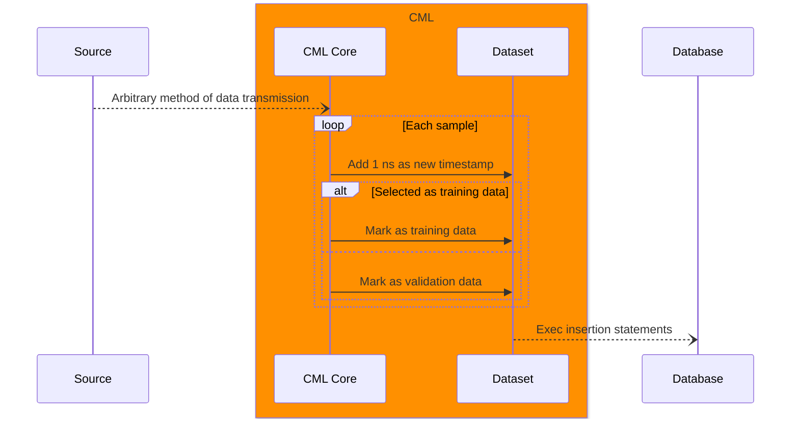
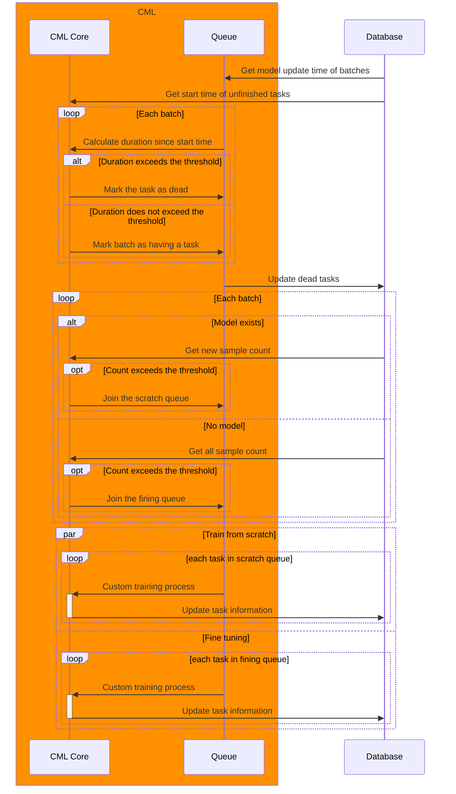
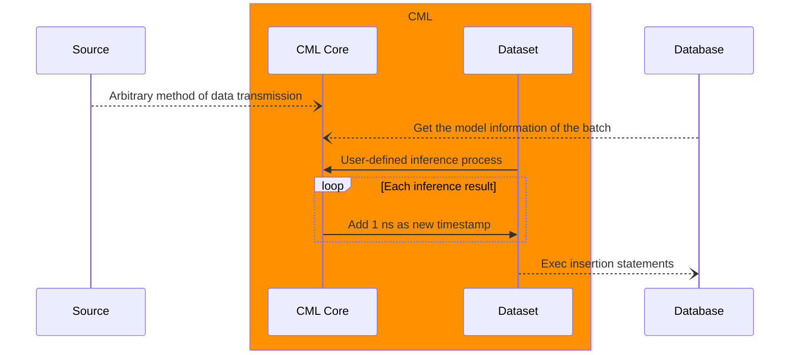

# Architecture

Time-series databases are the most suitable option for persistent storage in continuous machine learning applications. They are optimized for handling large amounts of time-related data, making them well-suited for tasks such as monitoring, analyzing, and forecasting.

CML is designed as a framework that can utilize multiple types of time-series database for data persistence (currently only TDengine is supported).

The scenarios outlined in this architecture document have been abstracted into several traits, each of which has different implementations with different time-series databases. This design allows users to switch to a different database as a new persistence solution in their own product with minimal code changes.

## Registration of training data



### Timestamp

If a large amount of data is passed in simultaneously (the recommended method, see the section [Performance recommendation](#performance-recommendation)), the timestamp of each record will be **sequentially increased by 1 nanosecond**.

#### Pros

Someone may create an application server using CML, but there may be more than one client interacting with it at the same time, which may result in more than one record being generated simultaneously. For time-series databases, the timestamp is the unique identifier and the default index in the data table, similar to the primary key in relational databases, so we cannot use the same timestamp directly when inserting data. If multiple records are assigned the same timestamp, it will result in one of the consequences:

1. Some fields of the data written earlier will be overwritten by those written later;
2. The insertion will fails.

It is considered a good practice to use the time **when CML receives data** as the real timestamp and make slight adjustments to them.

#### Cons

The timestamp in the database is not the exact time when the data was generated. Although the deviation is extremely slight, it is still affected by factors such as performance and load of the machine running CML, as well as the network status.

### Splitting

The data passed into CML will be automatically split into training/validation sets through a random number generator that follows a uniform distribution. Below is an example:

```rust
use rand::Rng;
let mut rng = rand::thread_rng();
let is_train: bool = rng.gen::<f32>() >= 0.2;
```

#### Pros

We know that the function `rng.gen::<f32>()` generates a random `f32` floating-point number with equal probability in the range of `[0, 1)`. The `rng` variable also stores the state of the random number generator, allowing it to stably generate random numbers greater than `0.2` with a probability of `80%`, and vice versa. This makes it possible to split the dataset **at a granularity of one record** with a constant probability, while also preventing dataset imbalances caused by human labeling errors.

#### Cons

In certain scenarios, users are unable to manually split the dataset into training/validation sets.

## Task management



### Cleaning up of zombie tasks

Based on our sequence diagram, the training task should have a definite deadline, as there are situations that may lead to useless tasks:

1. Although using the database to record the current task status is the most reliable method, the database may also fail due to certain accidents (such as sudden power outages), causing the tasks to remain active perpetually;
2. Due to logical mistakes in the code (such as infinite loops or excessively large epoch limits), the training process may continue indefinitely. These tasks must be cleaned up every time the task queue is generated, otherwise, new training tasks will be blocked.

#### Solution

The user is required to provide a parameter `working_status` of type `&[&str]` (see [User-defined state](#user-defined-state)), along with an upper limit on the task duration. If a task is marked as active but exceeds its time limit, it will be removed before a new task queue is generated. This design fully considers the flexibility of the user-defined training process (see the section [below](#custom-training-process)).

### Custom training process

The user is required to provide a closure to define the training process of the model. This process includes but is not limited to the following parts:

1. Creation and splitting of the dataset
2. Data preprocessing
3. Model architecture definition
4. Definition of the model training process
5. Definition of the model validation process
6. Recording to the database when necessary throughout the entire training period.

## Inference



### Custom inference process

The user is required to provide a closure to define the inference process of the model. This process includes but is not limited to the following parts:

1. Define infer data method
2. Initialize the model (if needed) according to the batch name and the timestamp
3. Perform inference

### Flexible inference strategy

In some cases, users may require a combination of multiple inference processes.

#### Solution

Users can call the `inference` method more than once with different settings, particularly for the `available_status` parameter (see [User-defined state](#user-defined-state)).

## Performance recommendation

Data can be passed to CML one by one, but for best performance, it is recommended to pass in as much data as possible at once.

## User-defined state

In the following two scenarios, users are required to provide a `&[&str]` that:

- In `TaskConfig`: contains all the tags representing the active status of a task
- In `Inference::inference`: contains all the tags representing the required status of a task. For example, one can mark a certain combination of model status as available during one inference process, but use another combination of status for another inference process.
