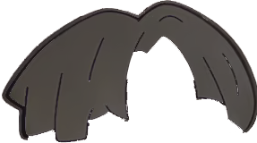

  <h1>CML</h1>
  <em>"Domain generalization is dead, Continuous Machine Learning lives forever." —— an iKun</em>
<table>
    <tbody>
        <tr>
            <td></td>
            <td><strong>CML is a framework for production-ready continuous machine learning in pure Rust.</strong></td>
        </tr>
    </tbody>
</table>

## Motivation

Domain-specific problem are widely prevalent in real-world scenarios.

To address this problem,

<table>
    <thead>
        <tr>
            <th>Traditional method</th>
            <th>CML method</th>
        </tr>
    </thead>
    <tbody>
        <tr>
            <td>
                <ul>
                    <li>Increasing the amount of training data</li>
                    <li>Optimizing model architecture</li>
                    <li>Applying diverse data augmentation techniques</li>
                </ul>
            </td>
            <td>Combining <strong>C</strong>ontinuous Integration with <strong>M</strong>achine <strong>Learning</strong></td>
        </tr>
        <tr>
            <td></td>
            <td></td>
        </tr>
    </tbody>
</table>

## How does it work?

See our [architecture document](ARCHITECTURE.md).

## Contributing

There is currently no code of conduct document available. However, we highly recommend that you read our [architecture document](ARCHITECTURE.md) first and foremost.
